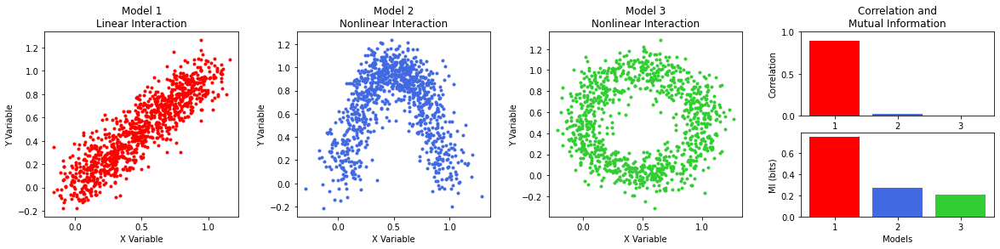

# Information Theory
Implementation of different information theory measures from [A Tutorial for Information Theory in Neuroscience](https://www.eneuro.org/content/5/3/ENEURO.0052-18.2018). The notebook summarizes the first part of the paper (Pages 1-20), and contains the code to replicate figures _2-6_ and _8-9(a,b)_.

<p align="center">
  
</p>


## Installation

To install the dependencies, run the following command:

```bash
pip install -r requirements.txt
```


## Usage

Open and execute the cells in `InformationTheory.ipynb` from `notebooks/`. 

